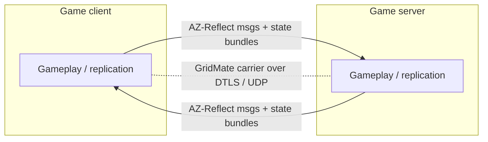
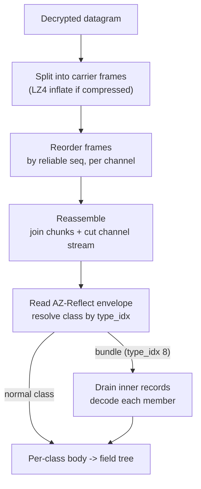
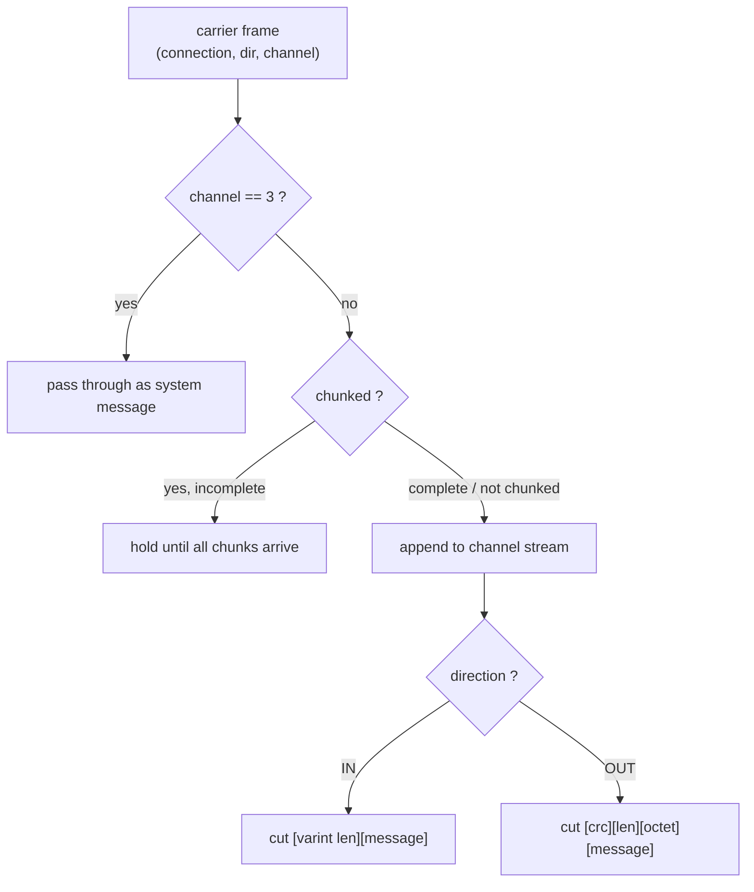
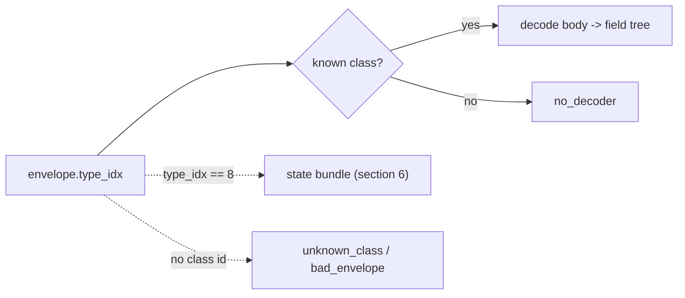
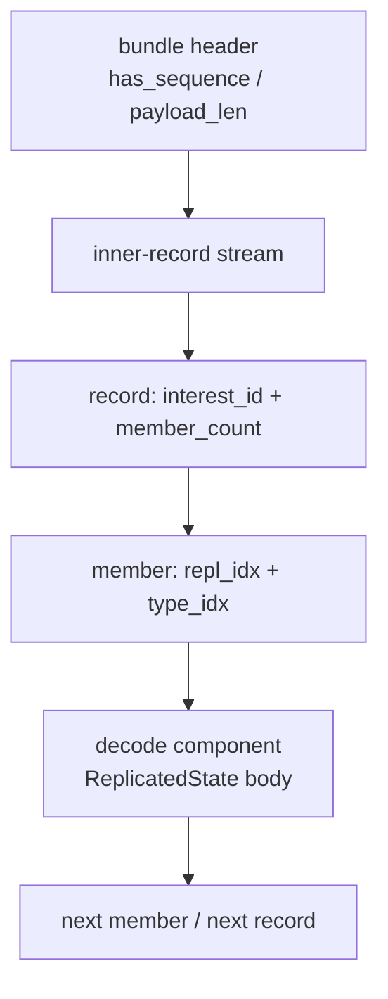
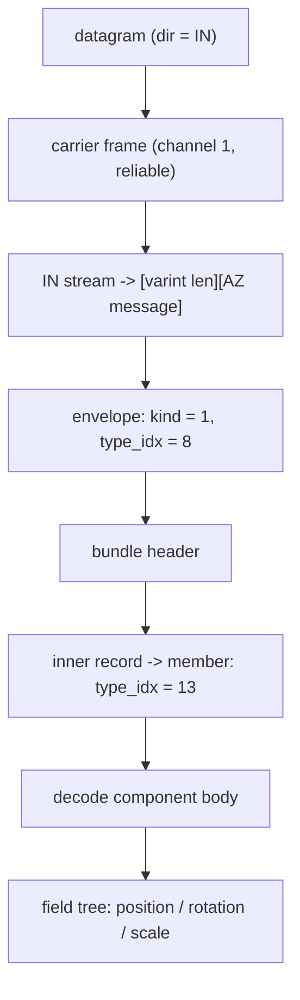

# New World packet system -- client <-> server

Network diagrams of how a New World game packet is structured, from the raw
decrypted datagram down to a typed component update.

Scope: the main game traffic -- GridMate carrier messages, the AZ-Reflect
message envelope, and AZ::DataSet state bundles. One worked example
(`PositionInTheWorldReplicatedState`) is traced end to end at the bottom.

The game encrypts everything in DTLS; the diagrams below start one layer below
DTLS, at the decrypted GridMate datagram. Wire layouts are shown as generic
pseudocode. Engine addresses (`@ 0x...`) cross-reference NewWorld.exe.

Pseudocode field types:

```
u8 u16 u32 u64       fixed-width integers (be = big-endian on the wire)
varint               LEB128 variable-length unsigned integer
uuid                 16 raw bytes
T[]                  a run of T until the enclosing length is consumed
T?  (flag)           field present only when the named flag/bit is set
```

---

## 1. The big picture

Both endpoints speak the same stack. Outer layers deliver bytes; inner layers
identify and decode them.



A packet is a nest of envelopes:

```
+--------------------------------------------------------------------------+
|  UDP datagram                                                            |
|  +--------------------------------------------------------------------+ |
|  |  DTLS record (encrypted on the wire)                               | |
|  |  +--------------------------------------------------------------+  | |
|  |  |  GridMate datagram   [mode][fmt][dgram_seq]                  |  | |
|  |  |  +--------------------------------------------------------+  |  | |
|  |  |  |  Carrier frame(s)  [flags][size][chan][seq][rel_seq].. |  |  | |
|  |  |  |  +--------------------------------------------------+  |  |  | |
|  |  |  |  |  Reassembled message (per channel stream)        |  |  |  | |
|  |  |  |  |   IN : [varint len][ AZ-Reflect message ]        |  |  |  | |
|  |  |  |  |   OUT: [crc][len][octet][ AZ-Reflect message ]   |  |  |  | |
|  |  |  |  |  +--------------------------------------------+  |  |  |  | |
|  |  |  |  |  |  AZ-Reflect envelope  [flags]..[type_idx]  |  |  |  |  | |
|  |  |  |  |  |  +--------------------------------------+  |  |  |  |  | |
|  |  |  |  |  |  |  Body (per class)                    |  |  |  |  |  | |
|  |  |  |  |  |  |   normal class -> field tree         |  |  |  |  |  | |
|  |  |  |  |  |  |   bundle       -> inner records      |  |  |  |  |  | |
|  |  |  |  |  |  +--------------------------------------+  |  |  |  |  | |
|  |  |  |  |  +--------------------------------------------+  |  |  |  | |
|  |  |  |  +--------------------------------------------------+  |  |  | |
|  |  |  +--------------------------------------------------------+  |  | |
|  |  +--------------------------------------------------------------+  | |
|  +--------------------------------------------------------------------+ |
+--------------------------------------------------------------------------+
```

---

## 2. How a packet is peeled



| Layer            | Identified by            | Carries |
|------------------|--------------------------|---------|
| GridMate datagram| mode + format header     | one or more carrier frames |
| Carrier frame    | flags + channel          | a slice of a per-channel byte stream |
| Reassembled msg  | direction (IN / OUT)     | one AZ-Reflect message |
| AZ-Reflect msg   | envelope `type_idx`      | a component update, or a state bundle |
| Bundle member    | inner `type_idx`         | one component's replicated state |

---

## 3. Datagram + carrier frames

The decrypted datagram is a 4-byte header followed by one or more carrier
frames. If the compress bit is set, everything after the header is one LZ4
block and is inflated before frame parsing.

```
GridMateDatagram {
    u8       mode         // 0x80 = plaintext, 0x81 = compressed (bit 0x01)
    u8       format       // always 0x01
    u16be    dgram_seq
    Frame[]  frames       // until end of datagram (after LZ4 inflate if compressed)
}
```

Each frame has a variable header -- a field is present only when its flag bit
is set:

```
Frame {
    u8       flags
    u16be    data_size
    u8       channel        ? (flags & DATA_CHANNEL 0x20)
    u16be    num_chunks     ? (flags & CHUNKS       0x04)
    u16be    seq            ? (first frame, or NOT SEQUENTIAL_ID 0x08)  // else prev+1
    u16be    rel_seq        ? (NOT SEQUENTIAL_REL_ID 0x10)              // else prev+1 if RELIABLE
    u8       payload[data_size]
}
```

Flag bits:

| Bit  | Name              | Meaning |
|------|-------------------|---------|
| 0x01 | RELIABLE          | frame is reliable (has / derives rel_seq) |
| 0x04 | CHUNKS            | frame is one piece of a chunked message |
| 0x08 | SEQUENTIAL_ID     | seq omitted on wire; = previous + 1 |
| 0x10 | SEQUENTIAL_REL_ID | rel_seq omitted on wire; = previous + 1 |
| 0x20 | DATA_CHANNEL      | an explicit channel byte follows |
| 0x80 | CONNECTING        | connection-setup frame |

When a `SEQUENTIAL_*` bit is set the sequence number is **not on the wire** --
it is reconstructed as `previous + 1` per channel, so frames must be processed
in order.

Channels:

| Id | Name                | Typical content |
|----|---------------------|-----------------|
| 0  | RELIABLE_EVENT      | reliable events / RMI / top-level AZ-Reflect messages |
| 1  | MAIN_REPLICATION    | replication -- where state bundles flow |
| 3  | SYSTEM              | connect / ack / clock-sync / bandwidth (carrier control) |

Default channel (no `DATA_CHANNEL` byte) is `0`.

---

## 4. Reorder + reassemble

Frames are grouped by `(connection, direction, channel)`. Chunked frames
accumulate until complete, then the joined blob feeds the channel byte-stream,
which is cut into individual messages.



### The IN / OUT split

The same AZ-Reflect message is framed differently per direction:

```
IN  (server -> client):
    [ varint msg_len ][ ......... msg_len bytes ......... ] [ next record ]...
                       ^-- AZ-Reflect message (envelope + body)

OUT (client -> server):
    [ u32be crc ][ u32be len ][ 16-byte octet (zeros) ][ AZ-Reflect message ] ...
      ^-- crc32 over the (len) bytes that follow the 8-byte header
```

- IN messages are varint length-prefixed.
- OUT messages are wrapped in a CRC frame: 4-byte CRC32, 4-byte length, a
  16-byte zero octet, then the message.

---

## 5. AZ-Reflect envelope

Every non-system message (both directions) starts with the envelope, which
identifies the class. Optional fields appear only when their flag bit is set.

```
AzReflectEnvelope {
    u8     flags
    u64be  hash0        ? (flags & 0x01)
    u64be  hash1        ? (flags & 0x02)
    ExtEnvelope ext     ? (flags & 0x04)
    u8     kind
    // kind == 1 -> a class id follows:
    varint type_idx     ? (kind == 1)
    uuid   inline_uuid  ? (kind == 1 AND type_idx == 0)   // class looked up by UUID
    // kind == 0 -> no class id; envelope ends
}

ExtEnvelope {            // rare; flags & 0x04
    u32be  ext_u32
    uuid   uuid_a
    uuid   uuid_b
    varint ext_v64
    u8     has_opt
    varint opt_v64      ? (has_opt == 1)
}

// everything after the envelope is the class body
```

`type_idx` is the build-stable class index assigned by the engine at startup --
the key that selects which body decoder to run. `type_idx == 0` means the class
is named by an inline 16-byte UUID instead.



System messages (channel 3) have **no envelope**: the message id is the *last*
byte of the payload (connect / ack / disconnect / clock-sync / acks).

---

## 6. State bundles (type_idx 8)

The high-volume replication path. A bundle is itself an AZ-Reflect message
(`type_idx == 8`) whose body is a small header plus a payload packed with many
per-component state updates.

```
StateBundle {                 // the body of a type_idx==8 message
    u8     has_sequence
    varint sequence       ? (has_sequence == 1)
    u8     chunk_class
    u8     chunk_kind
    u8     bool_a
    u8     bool_b
    varint hint           ? (bool_b == 1)
    varint count          ? (bool_b == 1)
    u16    index[count]   ? (bool_b == 1)
    varint payload_len
    u8     payload[payload_len]    // the inner-record stream
}

InnerRecord {                 // repeats across the payload
    varint interest_id
    u8     member_count
    Member members[member_count]
}

Member {
    varint replication_index
    varint type_idx
    uuid   inline_uuid    ? (type_idx == 0)
    Body   body                   // decoded by the member class (section 7)
}
```

Nesting:

```
StateBundle (type_idx 8)
|
+-- record[0]            interest_id, member_count
|     +-- member[0]      repl_idx, type_idx -> component update
|     +-- member[1]      repl_idx, type_idx -> component update
|     +-- ...
+-- record[1]
|     +-- member[0] ...
+-- ...
```



If a member's `type_idx` is unknown, that record stops and is reported as
`no_decoder` -- unknown bytes are never silently skipped.

---

## 7. Example: `PositionInTheWorldReplicatedState`

A small, intuitive component: an entity's position, rotation, and scale. It
travels inside a state bundle on the replication channel.
Class `type_idx = 13`, UUID `79C28008-4FC5-4EFB-88A1-538F4FB7DDE1`.

### Path of one update



### Component body (DataSet bitmap layout)

The body is a presence bitmap, then the present members back to back. Engine
reader `NW_AZ_DataSetContainer_PhaseA @ 0x1417B417C`.

```
PositionInTheWorldReplicatedState {
    u8  outer_bitmap                      // bit0 set -> slot0 follows
    // present only if outer_bitmap bit0 set:
    u8  inner_bitmap                      // member presence within slot0
    Position position    ? (inner_bitmap & 0x01)
    Rotation rotation    ? (inner_bitmap & 0x02)
    Scale    scale       ? (inner_bitmap & 0x04)
    u8  inner_bitmap[]                    // repeats while previous bit 0x80 set
}

Position {                                // compressed XYZ  @0x145CEA1B7
    u32be x_raw
    u32be y_raw
    u16be z_raw                           // bounded float, range -100.0 .. 2000.0
}

Rotation {                                // compressed quaternion  @0x145CEA15E
    u8    mask                            // which components are present
    u16be component[0..3]                 // present components only; w is derived
}

Scale {                                   // compressed scale  @0x145CEA28E
    u8    tag                             // 0 = identity, 1 = uniform, 2 = xyz
    u16be value[0 | 1 | 3]               // half-floats, per tag
}
```

Notes:
- `outer_bitmap` bit0 clear -> the component sent nothing this tick (valid, empty).
- The `0x80` continuation bit on an inner bitmap means more inner bitmaps follow.
- Each read advances exactly to the member's length; leftover bytes are flagged,
  never skipped.

### Decoded result

```json
{
  "class": "MB::PositionInTheWorldReplicatedState",
  "has_position": true,
  "position": { "x": 5731.42, "y": 2840.10, "z": 142.7 },
  "has_rotation": true,
  "rotation": { "x": 0.0, "y": 0.0, "z": -0.7071, "w": 0.7071 },
  "has_scale": false
}
```

---

## 8. Decode outcomes

Every message ends in exactly one outcome:

| Outcome        | Meaning |
|----------------|---------|
| `decoded`      | envelope + body fully parsed, zero leftover bytes |
| `no_decoder`   | class identified but its `type_idx` has no body decoder |
| `unknown_class`| envelope carried no resolvable class id |
| `bad_envelope` | envelope / body malformed, or leftover bytes after decode |

`leftover_bytes != 0` forces `bad_envelope` -- a decoder that under-consumes is
a bug, not a tolerated case.

---

## 9. Engine reference (NewWorld.exe)

The wire formats above were derived from these engine functions (From IDA Static Analysis):

| Engine function | EA | Role |
|-----------------|----|------|
| `UnmarshalAndLookupHandler` | `0x1417B2430` | reads marker + type_idx + body; finds the per-class helper |
| `NW_AZ_DataSetContainer` | `0x1417B417C` | the presence-bitmap body reader (section 7) |
| `NW_ReplicaCarrier_Subscriber_OnReceive` | `0x146B288F0` | bundle delivery entry on the replica side |

TypeDescriptor helper vtable (per class): `+0x10` CreateInstance,
`+0x28` Unmarshal, `+0x18` Destroy; `type_idx` lives at `descriptor + 0x54`.
